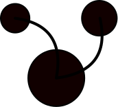

<p align="center">
</a>
</p>

<h3 align="center">
<b>A simple message broker powered by RocksDB</b>
</h3>

<p align="center">
    <a href="https://www.buymeacoffee.com/brunneis" target="_blank"></a>
</p>

# Initialise the data dir
```bash
mkdir -p ./data/streams
touch ./data/streams/.active
```

# Start the server
```bash
docker-compose up -d
```